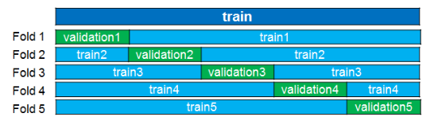

# 3. Méthodologie (Azat)

## 3.1 Pré-traitement des données

Le prétraitement des données est une technique d'exploration de données qui consiste à transformer des données brutes dans un format compréhensible. Les données réelles sont souvent incomplètes, incohérentes et sont susceptibles de contenir de nombreuses erreurs.

### 3.1.1 Pré-traitements classiques

**Center scale**

Une variable centrée réduite est la transformée d'une variable aléatoire par une application affine

- Centrer une variable consiste à soustraire son espérance à chacune de ses valeurs initiales, soit retrancher à chaque donnée la moyenne
- Réduire une variable consiste à diviser toutes ses valeurs par son écart type.

Une variable centrée réduite $x$ est calculée par: $x = \frac {X-\mu}{\sigma}$

**One hot encoding** 

"One hot encoding" est un processus par lequel les variables catégorielles sont converties en une forme qui pourrait être fournie aux algorithmes ML pour faire un meilleur travail de prédiction. Donc, il encode les caractéristiques catégorielles sous la forme de tableau numérique *one-hot*.

Exemple: on a une variable «couleur», il y a 3 catégories *(vert, bleu, noir)* et donc 3 variables binaires sont nécessaires. Une valeur «1» est placée dans la variable binaire pour la bonne couleur et des valeurs «0» pour les autres couleurs.

# ???

**Model Matrix** 

La fonction de R *model.matrix* crée une matrice de conception (ou de modèle), par exemple, en étendant les facteurs à un ensemble de variables fictives (en fonction des contrastes) et en élargissant les interactions de manière similaire.

### 3.1.2 Imputation des données manquantes

Si dans le jeu de données des valeurs manquantes ont été trouvées, notre application vous proposera de faire l'imputation. L'imputation multivariée par équations chaînées */Multivariate imputation by chained equations(MICE)/* est couramment utilisée pour imputer les données manquantes. Nous avons utilisé le package éponyme en R pour implémenter les imputations. Pour le moment, ces méthodes d'imputation sont disponibles:

- pmm  */Predictive mean matching (Correspondance moyenne prédictive)/* : Il vise à réduire le biais introduit dans un ensemble de données par imputation, en tirant des valeurs réelles échantillonnées à partir des données.

- norm : Calcule les imputations pour les données manquantes univariées par régression linéaire bayésienne, également connue sous le nom de modèle normal.

- mean : Une autre technique d'imputation consiste à remplacer toute valeur manquante par la moyenne de cette variable pour tous les autres cas, ce qui présente l'avantage de ne pas modifier la moyenne de l'échantillon pour cette variable

- rf : L'imputation de la forêt aléatoire est une technique d'apprentissage automatique qui peut prendre en charge les non-linéarités et les interactions et ne nécessite pas de modèle de régression particulier à spécifier

## 3.2 Echantillonnage - Optimisation du modèle

### 3.2.1 Découpage des données

Quand on dit optimisation du modèle, on parle d'optimisation des hyper-paramètres, c'est-à-dire trouver le bon niveau de complexité du modèle. Il y a deux possibilités: l'utilisation d’un jeu de validation et l'utilisation de techniques de validation croisée. Au préalable, on définit un jeu de test pour évaluer les performances du modèle *(une fois optimisé)*.

{width=300px}

Et avec jeu de validation on suit ces étapes:

- construire les différents modèles sur le jeu train 
- évaluer leurs performances sur le jeu de validation 
- choisir les meilleurs hyperparamètres 
- construire le modèle final sur {train + validation } 
- estimer les performance sur le jeu de test

C'est le cas le plus simple.

### 3.2.2 Validation croisée

Princip de validation croisée est: 

- on découpe les données d’apprentissage en K parties - les folds *(les données de test sont toujours de côté)*
- pour k = 1, ..., K
  - fold k = données de validation
  - autres folds = données d’apprentissage
- pour $k = 1 \ a \ K$, il faut :
  - mettre de côté la $k-ième$ fold
  - apprendre le modèle sur les $K - 1$ folds restantes
  - appliquer le modèle sur les données de la $k - ième$ fold

A la fin, on évalue les performances du modèle.

Ici, on évalue les performances sur tout le jeu d’apprentissage

{width=400px}

## 3.3 Algorithmes d'apprentissage automatique

Afin de répondre au mieux à notre problématique nous avons fait le choix d’utiliser plusieurs algorithms différentes pour analyser nos données.

## kNN /k-ppv/

L’algorithme des kNN consiste a trouver est les $k$ observations $x_i$ les plus proches de l’observation $x'$ a classifier. Ensuite, il faut definir $f(x')$ en fonction des reponses $y_i$ des kNN. Pour la regression c’est la valeur moyenne et pour la classification - la vote majoritaire. Les questions ouvertes pour cette algorithme est la choix du **critere de distance** et de la **valeur de k**.

- kNN pour la regression:

$$\tilde{f}(x)=moyenne(y_i | i \in N_k(x))$$
$$\Rightarrow  \text{approxime directement la fonction de regression} \ E[Y|X]$$

**Nature de l’approximation**

1. espérance $\rightarrow$ moyenne empirique
2. valeur ponctuelle $\rightarrow$ voisinage (dans le conditionnement)

- kNN pout la classification:

$$\tilde{f}(x)=majorite(y_i|i \in N_k(x))=arg \underset{l=1,\dots, K}{max} \tilde{P}_l=\frac{1}{k} \sum_{i \in N_k(x))} 1 (y_i=l)$$
$$\Rightarrow \text{approxime directement le classifieur de Bayes:}$$
$$arg \underset{l=1,\dots, K}{max} P(Y=C_l|X=x)$$

**Nature de l’approximation**

1. probabilité $\rightarrow$ proportion empirique
2. valeur ponctuelle $\rightarrow$ voisinage (dans le conditionnement)

## CART - Classification & Regression Trees

De base, les algorithmes d’arbre de décision ne sont rien d’autre que des instructions if-else qui peuvent être utilisées pour prédire un résultat basé sur des données. La méthodologie CART ou Arbres de classification et de régression fait référence à ces deux types d’arbres de décision.

- arbres de classification

Un arbre de classification est un algorithme dans lequel la variable cible est fixe ou catégorielle. L’algorithme est ensuite utilisé pour identifier la «classe» dans laquelle une variable cible se situerait le plus probablement. Un arbre de classification divise l’ensemble de données en fonction de l’homogénéité des données. Disons, par exemple, qu’il y a deux variables; revenu et âge; qui déterminent si un consommateur achètera ou non un type particulier de téléphone.

Si les données de formation montrent que 95% des personnes de plus de 30 ans ont acheté le téléphone, les données y sont divisées et l’âge devient un nœud supérieur dans l’arbre. Cette division rend les données
«pures à 95%». Des mesures d’impuretés comme l’entropie ou l’indice de Gini sont utilisées pour quantifier l’homogénéité des données en ce qui concerne les arbres de classification.

- arbres de régression

Un arbre de régression fait référence à un algorithme dans lequel se trouve la variable cible et l’algorithme utilisé pour prédire sa valeur. Dans un arbre de régression, un modèle de régression est ajusté à la variable cible en utilisant chacune des variables indépendantes. Après cela, les données sont divisées en plusieurs points pour chaque variable indépendante.

À chacun de ces points, l’erreur entre les valeurs prédites et les valeurs réelles est mise au carré pour obtenir une «somme des erreurs au carré» (SEC). Le SEC est comparée entre les variables et la variable ou le point qui a le SEC le plus bas est choisi comme point de partage. Ce processus se poursuit récursivement.

## Random Forest

À la base, la méthode des forêts aléatoires est basée sur le bagging /aggrégation par bootstrap/, il est très performant sur de nombreux problèmes et facile à paramétrer. Principe d’algorithmes et de découper l’espace d’entrée en région, estimer et prédire une valeur par région. Pour la régression on choisit une valeur moyenne dans la région, et pour la classification on choisit la classe majoritaire. Les avantages de cette méthode sont l’interprétabilité du modèle et le mécanisme de prédiction proche du processus humain.

## rfRanger

Ranger est une implémentation rapide de forêts aléatoires ou partitionnement récursif, particulièrement adapté aux données de grande dimension. Les forêts de classification, de régression et de survie sont prises en charge. Les forêts de classification et de régression sont mises en œuvre comme dans la forêt aléatoire d'origine, les forêts de survie comme dans les forêts de survie aléatoire.

## XGBoost

La bibliothèque XGBoost implémente l’algorithme d’arbre de décision de renforcement du gradient. Le boosting est une technique d’ensemble où de nouveaux modèles sont ajoutés pour corriger les erreurs
commises par les modèles existants. Les modèles sont ajoutés séquentiellement jusqu’à ce qu’aucune autre amélioration ne puisse être apportée.

L’amplification du gradient est une approche où de nouveaux modèles sont créés qui prédisent les résidus ou les erreurs des modèles précédents, puis additionnés pour faire la prédiction finale. Il est appelé boosting de gradient car il utilise un algorithme de descente de gradient pour minimiser la perte lors de l’ajout de nouveaux modèles.

Cette approche prend en charge à la fois les problèmes de modélisation prédictive de régression et de classification.

## glmNetL2 - Ridge Regression

Régression linéaire avec perte quadratique et pénalité L2 :

$$(w^*, b^*) = \underset{w \in \mathbb{R^p}, b \in \mathbb{R}}{argmin} \sum^n_{i=1}(y_i-f(x_i))^2 + \lambda ||w||^2_2$$
$$= \underset{w \in \mathbb{R^p}, b \in \mathbb{R}}{argmin} \sum^n_{i=1}(y_i-b - \sum^p_{j=1}w_jx_{ij} + \lambda \sum^p_{j=1} w^2_j$$

la régression ridge impose donc une contrainte sur les coefficients (w). Le terme de pénalité ($\lambda$) régularise les coefficients de telle sorte que si les coefficients prennent de grandes valeurs, la fonction d’optimisation est pénalisée. Ainsi, la régression ridge réduit les coefficients et contribue à réduire la complexité du modèle et la multi-colinéarité.

Pour le résoudre il faut centrer les variables $\rightarrow \tilde{x}_{ij} = x_{ij}- \bar{x}$

1. on estime alors l’intercept $b$ par $b^*=\hat{y}=\frac{1}{n}\sum^n_{i=1} y_i$
2. on obtient w avec le meme probleme sans intercept
3. solution : $w^*=(X^TX+\lambda I)^{-1} X^Ty \ ou \ X[i,j]=\tilde{x}_{ij}$

## glmNetL1 - Lasso Regression

Régression linéaire avec perte quadratique et pénalité L1 :

$$(w^*, b^*) = \underset{w \in \mathbb{R^p}, b \in \mathbb{R}}{argmin} \sum^n_{i=1}(y_i-f(x_i))^2 + \lambda ||w||_1$$
$$= \underset{w \in \mathbb{R^p}, b \in \mathbb{R}}{argmin} \sum^n_{i=1}(y_i-b - \sum^p_{j=1}w_jx_{ij} + \lambda \sum^p_{j=1} |w_j|$$

Si on regarde l’equation en detail, in peut voir que la seule différence est qu’au lieu de prendre le carré des coefficients, les grandeurs sont prises en compte. Ce type de régularisation (L1) peut conduire à des coefficients nuls, c’est-à-dire que certaines caractéristiques sont complètement négligées pour l’évaluation des résultats. Ainsi, la régression Lasso aide non seulement à réduire le sur-ajustement, mais elle peut également nous aider à sélectionner les variables.

Du coup, par rapport à pénalité ridge :

- même effet de régularisation : shrinkage des coefficients
- mais conduit à des coefficients exactement = 0

$\Rightarrow$ solution parcimonieuse (sparse) : sélection de variables

## AdaBoost Classification Trees ????
## AdaBoost M1

AdaBoost (boosting adaptatif) est un algorithme d’apprentissage assembliste qui peut être utilisé pour la classification ou la régression. Bien qu’AdaBoost résiste mieux au surajustement qu’un grand nombre d’algorithmes de machine learning, il est parfois sensible aux données bruitées et aux valeurs aberrantes. 

AdaBoost est désigné comme adaptatif car il utilise de nombreuses itérations pour générer un apprenant composite fort. AdaBoost crée l’apprenant fort (un classifieur bien corrélé au classifieur correct) en ajoutant de manière itérative des apprenants faibles (un classifieur légèrement corrélé au classifieur correct). Lors de chaque session d’apprentissage, un nouvel apprenant faible est ajouté à l’ensemble et un vecteurpondération est ajusté afin de mettre l’accent sur les exemples ayant été classés de manière incorrecte lors des sessions précédentes. Par conséquent, le classifieur obtenu est doté d’une meilleure précision queclassifieurs des apprenants faibles. 

AdaBoost.M1 represente les algorithmes originaux de classification binaire.

## 3.4 Programmation

### 3.4.1 Caret

Le package caret *(abréviation de Classification And REgression Training)* est un ensemble de fonctions qui tentent de rationaliser le processus de création de modèles prédictifs. Le package contient des outils pour:

- découpage des données
- prétraitement
- sélection de fonctionnalité
- réglage du modèle */tuning/* à l'aide du rééchantillonnage
- estimation d'importance variable ainsi que d'autres fonctionnalités.

### 3.4.2 Tidyverse (Mamadou)
