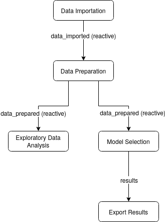

\begin{titlepage} 


    \newcommand{\HRule}{\rule{\linewidth}{1mm}}  

  \vspace*{1cm} 


\begin{center} 

\textsc{\LARGE Université Grenoble-Alpes }\\[1.5cm] 

\end{center} 

  \vspace*{2cm} 


\HRule\\ 
    \begin{center} 
    
    {\LARGE\bfseries Développement d'application RShiny }\\[0.4cm]  

    \end{center} 

    \HRule\\[0.7cm] 

     

\begin{flushleft} 

            \large 

            \textbf{Auteurs}\\ 

            Komi \textsc{Agblodoe}\newline
            Azat \textsc{Aleksanyan}\newline 
            Lucas \textsc{Chabeau}\newline 
            Mamadou \textsc{Diamban}\newline 
            Soheil \textsc{Salmani} 

\end{flushleft} 

         

\begin{flushright} 

            \large 

            \textbf{Tuteur}\\ 

 Didier \textsc{Morel}  \\


\end{flushright} 
\vspace*{3cm} 


\begin{center}
\textbf{\large 21 février 2020} 
\end{center}


\end{titlepage} 

\newpage

# Remerciements

Nous tenons à remercier particulièrement Monsieur Didier Morel pour leur aide, leur disponibilité et leur écoute tout au long du projet.

Nous remercions aussi le BD pour la confiance qu'ils nous ont accordé avec ce projet.

\newpage

\renewcommand{\contentsname}{Table des Matières}
\tableofcontents

\newpage

# 1. Introduction

Dans le cadre de notre préparation au diplôme de master en statistiques et sciences de données, nous avons été amenés à effectuer notre projet de cinquième année en partenariat avec l'entreprise BD (Becton et Dickinson) et sous l'encadrement de Didier Morel.
 
Il concerne le développement d'une application RShiny permettant de comparer et de tester des algorithmes de Machine Learning. Dans la mesure où l'entreprise BD ne dispose d'aucune application en ligne permettant de réaliser ce type de travail, il semble très intéressant de mettre en place un tel outil. Ainsi, les expérimentés comme les personnes sans trop de connaissances en apprentissage automatique pourront se servir de l'application pour avoir un aperçu de  l'efficacité de différentes méthodes.

Dans ce projet, après avoir identifié le contexte, les besoins et les contraintes, nous avons procédé à la construction de notre application en créant deux fichiers dont un pour le serveur et le second pour l'interface utilisateur. Nous avons implémenté dans notre application, des algorithmes de classification supervisée et de régression comme AdaBoost Classification Trees, AdaBoost.M1, CART, les k plus proches voisins (kNN), le randomForest, RfRanger, XGBoost, Ridge, Lasso. Pour ces différents algorithmes, l'utilisateur a la possibilité de choisir les paramètres voulus. Nous avons ensuite procédé aux tests sur des jeux de données afin de comparer la performance des différents algorithmes de classification supervisée et de régression. Il faut noter aussi que notre application est capable de charger les jeux de données de type CSV et TSV.

\newpage

# 2. Contexte

L’évolution des techniques de fouilles de données et d'apprentissage automatique, ainsi que l’accroissement des capacités de stockage et de calcul suscite, dans tous les domaines, un intérêt pour les données produites. En ce sens, les domaines dans lesquels intervient l'entreprise BD ne font pas exception. Notre projet s'inscrivant dans ce contexte, cette application est destinée à devenir un outil d’investigation rapide utilisable en interne par des collaborateurs BD en possession de jeux de données sur lesquels ils souhaiteraient pouvoir obtenir une idée rapide de la performance de différents types de modèles de prédictions.

# 3. Méthodologie

## 3.1 Pré-traitement des données

Le prétraitement des données est une technique d'exploration de données qui consiste à transformer des données brutes dans un format compréhensible. Les données réelles sont souvent incomplètes, incohérentes et sont susceptibles de contenir de nombreuses erreurs.

### 3.1.1 Pré-traitements classiques

**Center scale**

Une variable centrée réduite est la transformée d'une variable aléatoire par une application affine

- Centrer une variable consiste à soustraire son espérance à chacune de ses valeurs initiales, soit retrancher à chaque donnée la moyenne
- Réduire une variable consiste à diviser toutes ses valeurs par son écart type.

Une variable centrée réduite $x$ est calculée par: $x = \frac {X-\mu}{\sigma}$

**One hot encoding** 

"One hot encoding" est un processus par lequel les variables catégorielles sont converties en une forme qui pourrait être fournie aux algorithmes ML pour faire un meilleur travail de prédiction. Donc, il encode les caractéristiques catégorielles sous la forme de tableau numérique *one-hot*.

La fonction *model.matrix* en *R* crée une matrice de conception (ou de modèle), par exemple, en étendant les facteurs à un ensemble de variables fictives (en fonction des contrastes) et en élargissant les interactions de manière similaire.

Exemple: on a une variable «couleur», il y a 3 catégories *(vert, bleu, noir)* et donc 3 variables binaires sont nécessaires. Une valeur «1» est placée dans la variable binaire pour la bonne couleur et des valeurs «0» pour les autres couleurs.

### 3.1.2 Imputation des données manquantes

Si dans le jeu de données des valeurs manquantes ont été trouvées, notre application vous proposera de faire l'imputation. L'imputation multivariée par équations chaînées */Multivariate imputation by chained equations(MICE)/* est couramment utilisée pour imputer les données manquantes. Nous avons utilisé le package éponyme en R pour implémenter les imputations. Pour le moment, ces méthodes d'imputation sont disponibles:

- rf: imputation par random forest 
- pmm  */Predictive mean matching (Correspondance moyenne prédictive)/* : Il vise à réduire le biais introduit dans un ensemble de données par imputation, en tirant des valeurs réelles échantillonnées à partir des données.
- norm : Calcule les imputations pour les données manquantes univariées par régression linéaire bayésienne, également connue sous le nom de modèle normal.
- mean : Une autre technique d'imputation consiste à remplacer toute valeur manquante par la moyenne de cette variable pour tous les autres cas, ce qui présente l'avantage de ne pas modifier la moyenne de l'échantillon pour cette variable

## 3.2 Echantillonnage - Optimisation du modèle

### 3.2.1 Découpage des données

Quand on dit optimisation du modèle, on parle d'optimisation des hyper-paramètres, c'est-à-dire trouver le bon niveau de complexité du modèle. Il y a deux possibilités: l'utilisation d’un jeu de validation et l'utilisation de techniques de validation croisée. Au préalable, on définit un jeu de test pour évaluer les performances du modèle *(une fois optimisé)*.

{width=300px}

Et avec jeu de validation on suit ces étapes:

- construire les différents modèles sur le jeu train 
- évaluer leurs performances sur le jeu de validation 
- choisir les meilleurs hyperparamètres 
- construire le modèle final sur {train + validation } 
- estimer les performance sur le jeu de test

C'est le cas le plus simple.

### 3.2.2 Validation croisée

Princip de validation croisée est: 

- on découpe les données d’apprentissage en K parties - les folds *(les données de test sont toujours de côté)*
- pour k = 1, ..., K
  - fold k = données de validation
  - autres folds = données d’apprentissage
- pour $k = 1 \ a \ K$, il faut :
  - mettre de côté la $k-ième$ fold
  - apprendre le modèle sur les $K - 1$ folds restantes
  - appliquer le modèle sur les données de la $k - ième$ fold

A la fin, on évalue les performances du modèle.

Ici, on évalue les performances sur tout le jeu d’apprentissage

{width=400px}

## 3.3 Algorithmes d'apprentissage automatique

Afin de répondre au mieux à notre problématique nous avons fait le choix d’utiliser plusieurs algorithms différentes pour analyser nos données.

**kNN /k-ppv/**

L’algorithme des kNN consiste a trouver est les $k$ observations $x_i$ les plus proches de l’observation $x'$ a classifier. Ensuite, il faut definir $f(x')$ en fonction des reponses $y_i$ des kNN. Pour la regression c’est la valeur moyenne et pour la classification - la vote majoritaire. Les questions ouvertes pour cette algorithme est la choix du **critere de distance** et de la **valeur de k**.

- kNN pour la regression:

$$\tilde{f}(x)=moyenne(y_i | i \in N_k(x))$$
$$\Rightarrow  \text{approxime directement la fonction de regression} \ E[Y|X]$$

**Nature de l’approximation**

1. espérance $\rightarrow$ moyenne empirique
2. valeur ponctuelle $\rightarrow$ voisinage (dans le conditionnement)

- kNN pout la classification:

$$\tilde{f}(x)=majorite(y_i|i \in N_k(x))=arg \underset{l=1,\dots, K}{max} \tilde{P}_l=\frac{1}{k} \sum_{i \in N_k(x))} 1 (y_i=l)$$
$$\Rightarrow \text{approxime directement le classifieur de Bayes:}$$
$$arg \underset{l=1,\dots, K}{max} P(Y=C_l|X=x)$$

**Nature de l’approximation**

1. probabilité $\rightarrow$ proportion empirique
2. valeur ponctuelle $\rightarrow$ voisinage (dans le conditionnement)


**CART - Classification & Regression Trees**

De base, les algorithmes d’arbre de décision ne sont rien d’autre que des instructions if-else qui peuvent être utilisées pour prédire un résultat basé sur des données. La méthodologie CART ou Arbres de classification et de régression fait référence à ces deux types d’arbres de décision.

- arbres de classification

Un arbre de classification est un algorithme dans lequel la variable cible est fixe ou catégorielle. L’algorithme est ensuite utilisé pour identifier la «classe» dans laquelle une variable cible se situerait le plus probablement. Un arbre de classification divise l’ensemble de données en fonction de l’homogénéité des données. Disons, par exemple, qu’il y a deux variables; revenu et âge; qui déterminent si un consommateur achètera ou non un type particulier de téléphone.

Si les données de formation montrent que 95% des personnes de plus de 30 ans ont acheté le téléphone, les données y sont divisées et l’âge devient un nœud supérieur dans l’arbre. Cette division rend les données
«pures à 95%». Des mesures d’impuretés comme l’entropie ou l’indice de Gini sont utilisées pour quantifier l’homogénéité des données en ce qui concerne les arbres de classification.

- arbres de régression

Un arbre de régression fait référence à un algorithme dans lequel se trouve la variable cible et l’algorithme utilisé pour prédire sa valeur. Dans un arbre de régression, un modèle de régression est ajusté à la variable cible en utilisant chacune des variables indépendantes. Après cela, les données sont divisées en plusieurs points pour chaque variable indépendante.

À chacun de ces points, l’erreur entre les valeurs prédites et les valeurs réelles est mise au carré pour obtenir une «somme des erreurs au carré» (SEC). Le SEC est comparée entre les variables et la variable ou le point qui a le SEC le plus bas est choisi comme point de partage. Ce processus se poursuit récursivement.

**Random Forest**

À la base, la méthode des forêts aléatoires est basée sur le bagging /aggrégation par bootstrap/, il est très performant sur de nombreux problèmes et facile à paramétrer. Principe d’algorithmes et de découper l’espace d’entrée en région, estimer et prédire une valeur par région. Pour la régression on choisit une valeur moyenne dans la région, et pour la classification on choisit la classe majoritaire. Les avantages de cette méthode sont l’interprétabilité du modèle et le mécanisme de prédiction proche du processus humain.

**rfRanger**

Ranger est une implémentation rapide de forêts aléatoires ou partitionnement récursif, particulièrement adapté aux données de grande dimension. Les forêts de classification, de régression et de survie sont prises en charge. Les forêts de classification et de régression sont mises en œuvre comme dans la forêt aléatoire d'origine, les forêts de survie comme dans les forêts de survie aléatoire.

**XGBoost**

La bibliothèque XGBoost implémente l’algorithme d’arbre de décision de renforcement du gradient. Le boosting est une technique d’ensemble où de nouveaux modèles sont ajoutés pour corriger les erreurs
commises par les modèles existants. Les modèles sont ajoutés séquentiellement jusqu’à ce qu’aucune autre amélioration ne puisse être apportée.

L’amplification du gradient est une approche où de nouveaux modèles sont créés qui prédisent les résidus ou les erreurs des modèles précédents, puis additionnés pour faire la prédiction finale. Il est appelé boosting de gradient car il utilise un algorithme de descente de gradient pour minimiser la perte lors de l’ajout de nouveaux modèles.

Cette approche prend en charge à la fois les problèmes de modélisation prédictive de régression et de classification.


**Ridge Regression**

Régression linéaire avec perte quadratique et pénalité L2 :

$$(w^*, b^*) = \underset{w \in \mathbb{R^p}, b \in \mathbb{R}}{argmin} \sum^n_{i=1}(y_i-f(x_i))^2 + \lambda ||w||^2_2$$
$$= \underset{w \in \mathbb{R^p}, b \in \mathbb{R}}{argmin} \sum^n_{i=1}(y_i-b - \sum^p_{j=1}w_jx_{ij} + \lambda \sum^p_{j=1} w^2_j$$

la régression ridge impose donc une contrainte sur les coefficients (w). Le terme de pénalité ($\lambda$) régularise les coefficients de telle sorte que si les coefficients prennent de grandes valeurs, la fonction d’optimisation est pénalisée. Ainsi, la régression ridge réduit les coefficients et contribue à réduire la complexité du modèle et la multi-colinéarité.

Pour le résoudre il faut centrer les variables $\rightarrow \tilde{x}_{ij} = x_{ij}- \bar{x}$

1. on estime alors l’intercept $b$ par $b^*=\hat{y}=\frac{1}{n}\sum^n_{i=1} y_i$
2. on obtient w avec le meme probleme sans intercept
3. solution : $w^*=(X^TX+\lambda I)^{-1} X^Ty \ ou \ X[i,j]=\tilde{x}_{ij}$


**Lasso Regression**

Régression linéaire avec perte quadratique et pénalité L1 :

$$(w^*, b^*) = \underset{w \in \mathbb{R^p}, b \in \mathbb{R}}{argmin} \sum^n_{i=1}(y_i-f(x_i))^2 + \lambda ||w||_1$$
$$= \underset{w \in \mathbb{R^p}, b \in \mathbb{R}}{argmin} \sum^n_{i=1}(y_i-b - \sum^p_{j=1}w_jx_{ij} + \lambda \sum^p_{j=1} |w_j|$$

Si on regarde l’equation en detail, in peut voir que la seule différence est qu’au lieu de prendre le carré des coefficients, les grandeurs sont prises en compte. Ce type de régularisation (L1) peut conduire à des coefficients nuls, c’est-à-dire que certaines caractéristiques sont complètement négligées pour l’évaluation des résultats. Ainsi, la régression Lasso aide non seulement à réduire le sur-ajustement, mais elle peut également nous aider à sélectionner les variables.

Du coup, par rapport à pénalité ridge :

- même effet de régularisation : shrinkage des coefficients
- mais conduit à des coefficients exactement = 0

$\Rightarrow$ solution parcimonieuse (sparse) : sélection de variables
  
**AdaBoost M1**

AdaBoost (boosting adaptatif) est un algorithme d’apprentissage assembliste qui peut être utilisé pour la classification ou la régression. Bien qu’AdaBoost résiste mieux au surajustement qu’un grand nombre d’algorithmes de machine learning, il est parfois sensible aux données bruitées et aux valeurs aberrantes. 

AdaBoost est désigné comme adaptatif car il utilise de nombreuses itérations pour générer un apprenant composite fort. AdaBoost crée l’apprenant fort (un classifieur bien corrélé au classifieur correct) en ajoutant de manière itérative des apprenants faibles (un classifieur légèrement corrélé au classifieur correct). Lors de chaque session d’apprentissage, un nouvel apprenant faible est ajouté à l’ensemble et un vecteurpondération est ajusté afin de mettre l’accent sur les exemples ayant été classés de manière incorrecte lors des sessions précédentes. Par conséquent, le classifieur obtenu est doté d’une meilleure précision queclassifieurs des apprenants faibles. 

AdaBoost.M1 represente les algorithmes originaux de classification binaire.

## 3.4 Programmation

### 3.4.1 Caret

Le package caret *(abréviation de Classification And REgression Training)* est un ensemble de fonctions qui tentent de rationaliser le processus de création de modèles prédictifs. Le package contient des outils pour:

- découpage des données
- prétraitement
- sélection de fonctionnalité
- réglage du modèle */tuning/* à l'aide du rééchantillonnage
- estimation d'importance variable ainsi que d'autres fonctionnalités.

### 3.4.2 Tidyverse

Le tidyverse est un système cohérent de packages pour la manipulation, l'exploration et la visualisation de données qui partagent une philosophie de conception commune. Ceux-ci ont été principalement développés par Hadley Wickham lui-même, mais ils sont maintenant développés par plusieurs contributeurs. Les packages Tidyverse sont destinés à rendre les statisticiens et les scientifiques des données plus productifs en les guidant à travers des flux de travail qui facilitent la communication et aboutissent à des produits de travail reproductibles. Fondamentalement, l'inverse concerne les connexions entre les outils qui rendent le workflow possible.

# 4. Présentation de l'application

Notre application web est constituée d'un menu  constitué de plusieurs permettant de contrôler chaque étape du processus de machine learning.

## 4.1 Présentation succinte de Shiny

Shiny, est un package R qui facilite la construction d'applications web interactives depuis R permettant une sortie en html. Une fonctionnalité d'une application shiny se divise en une partie UI et son traitement côté serveur associé. Plus précisemment:

- Un côté UI (User Interface) qui regroupe tous les éléments de mise en forme et d'affichage de l'interface utilisateur (affichage des inputs et des outputs).
- Un côté Serveur où sont exécutés les codes R qui servent à produire les éléments de sorties (graphiques, tables, traitements, etc..) et à les mettre à jour en cas de changement dans les valeurs d'entrées (inputs).

Les utilisateurs peuvent simplement manipuler l'application pour exécuter et afficher des résultats fournis par du code R.

## 4.2 Rôles de l'application

Le développement de cette application consiste en l'implémentation d'algorithmes d'apprentissage automatique avec la librairie caret. En utilisant l'application, l'utilisateur peut :

- Charger le fichier de données qu'il désire (CSV ou TSV)
- Visualiser quelques statistiques descriptives sur ses donées
- Imputer des valeurs manquantes selon différentes méthodes proposées par la package *mice*
- Choisir la proportion d'apprentissage
- Choisir le nombre de partitions de son échantillon d'apprentissage pour la validation croisée
- Choisir un ou plusieurs algorithmes d'apprentissage automatique et ses paramètres
- Sauvegarder / Charger une configuration d'algorithmes à tester
- Choisir la variable à expliquer
- Visualiser la qualité des modèles fournis par les algorithmes (erreurs/taux de bonne prédiction)


## 4.3 Contraintes de l'application

En ce qui concerne notre application web, différentes contraintes inhérentes à sa nature sont prises en compte à savoir:

- L'application doit être réactive
- L'application doit être facile à maintenir.

## 4.4 Description détaillée de l'application

L'interface utilisateur a été conçue pour être intuitive et fonctionnelle. Répondant aux contraintes, elle permet à l'utilisateur de charger un jeu de données (de type TSV ou CSV), de choisir les variables explicatives et celles à expliquer, ainsi que les algorithmes et les paramètres de son choix. Outre celà, l'utilisateur a aussi la possibilté de faire des statistiques decriptives pour lui permettre d'explorer son jeu de données.

Ci-dessous une capture d'écran de l'application avec un exemple à l'appui.

### 4.4.1 Préparation de donnees

Le premier onglet de notre application permet à l'utilisateur d'importer le jeu de données sur lequel il souhaite tester les différents algorithmes d'apprentissage automatique.

Les fichiers acceptés sont les fichiers texte avec séparateur (csv/tsv). L'utilisateur peut choisir le séparteur, le caractère de citation, préciser s'il y a une ligne d'entête et visualiser les premières lignes du jeu de données importé.

Nous avons décidés d'imposer à l'utilisateur de cliquer sur un bouton pour importer ses données une fois les paramètres d'importation remplis. Nous avons fait ce choix pour éviter à l'application de se mettre à jour dès que l'utilisateur change un paramètre, cela peut prendre beaucoup de temps pour des jeux de données trop volumineux. Ce bouton permet donc de rendre l'onglet plus fluide.

### 4.4.2 Statistiques Descriptives

Cet onglet permet à l'utilisateur de faire quelques analyses exploratoires des données pour visualiser les informations de bases à savoir:

- l'allocation de mémoire estimée en octets: *Memory usage*
- le nombre de colonnes discrètes: *Discrete columns*
- le nombre de colonnes continues: *Continuous colomns*
- le nombre de colonnes manquantes: *All missing columns*
- le nombre de lignes sans valeurs manquantes: *Complete rows*
- le nombre d'observations manquantes: *Missing observations*


L'observation des valeurs manquantes est détaillée avec le graphique *Missing Values* où l'on peut observer, pour chaque variable, la proportion de valeurs manquantes décrite comme suit:

- *Good* : quand la proportion des valeurs manquantes $\leq$ 0.05
- *OK* : 0.05 $<$ la proportion des valeurs manquante $\leq$ 0.4
- *Bad* : 0.4 $<$ la proportion des valeurs manquante $\leq$ 0.8
- *Remove* : 0.8 $<$ la proportion des valeurs manquante $\leq$ 1

Sur le troisième graphique, nous donnons à l'utilisateur la possibilité d'afficher un graphique en choisissant une variable. Si la variable est qualitative, on génère un diagramme en barre affichant la quantité de chaque modalité sinon une boite à moustache est générée permettant d'afficher les différents quantiles de la variable. 

Un autre point qui nous paraissait important était d'offrir la possibilité d'imputer les données lorsque celles-ci contiennent des valeurs manquantes. Pour cela, on calcule au préalable le nombre de valeurs manquantes sur les données. S'il est égal à zéro aucune proposition n'est faite. Et au contraire, s'il est supérieur à zéro, un bouton **Data Imputation** s'affiche et on laisse le choix à l'utilisateur de faire une imputation ou non.

L'imputation se fait grâce au package **mice** avec les quatre méthodes suivantes:

- rf
- pmm
- norm
- mean

Un graphique de la densité est présenté pour comparer les données observées et les données imputées de chaque variable. Toutefois s'il y'a plus de six variables contenant des données manquantes, seul un aperçu des données imputées est présenté sous forme de tableau.

### 4.4.3 ML Parameteres

Après avoir téléchargé le fichier de données et effectué quelques statistiques descriptives, l'utilisateur a la possibilité de choisir une liste d'algorithmes à tester, leurs hyperparamètres et les prétraitements à appliquer sur les données pour chaque algorithme. Cet onglet de l'application est fait pour ça. Son principal défi a été de proposer une interface utilisateur réactive permettant de répondre à la non-homogénéité des paramètres des fonctions de caret selon l'algorithme séléctionné.


#### 4.4.3.1 Choix des algorithmes

Notre objectif était ici de permettre à l'utilisateur de choisir de manière simple, un ou plusieur algorithmes à tester sur son jeu de données. Le problème est que la librairie Caret de R propose une énorme quantité d'algorithmes de classification et de régression. Il n'était donc pas pensable d'écrire cette liste en dur dans le code. Nous avons plutôt choisi d'en enregistrer une liste dans un tableau csv. Ce tableau comporte le nom de l'algorithme et son allias à saisir dans les fonctions de caret pour y faire référence. Ainsi, l'administrateur de l'application pourra ajouter ou supprimer des algorithmes de cette liste. Cette liste est celle qui est proposée dans l'interface utilisateur au travers d'un menu déroulant à choix multiple.

#### 4.4.3.2 Paramétrisation des algorithmes

Quand l'utilisateur séléctionne un algorithme, l'interface utilisateur se met à jour et propose la liste d'entrées correspondant chacune à un hyper-paramètre de l'algorithme. L'utilisateur n'a alors plus qu'à saisir les valeurs de son choix dans ces entrées pour les affecter aux hyper-paramètres. L'application étant déstinée à des utilisteurs déjà initiés au langage R, nous avons pûs nous permettre (en accord avec le tuteur) de demander à l'utilisateur d'utiliser des fonctions telles que *seq(), c()* ou des opérateurs tels que *:* pour exprimer un vecteur s'il désire tester plusieurs hyper-paramètres sur un algorithme.

Comme dit précédemment, la vraie difficulté a été d'afficher le bon nombre d'hyper-paramètres sachant que ce nombre n'est pas fixe selon les hyper-paramètres. Nous savions déjà qu'il nous faudrait utiliser un élément utilisateur (une entrée) *uiOutput*. Il s'agit d'un élément d'interface utilisateur qui n'est pas défini côté ui mais côté serveur. Cela nous permet d'avoir une certaine flexibilité car l'élément est issu d'un alogrithme auquel nous pouvons mettre des conditions, boucles etc. Il nous restait maintenant à régler le problème du nombre d'entrées (pas fixe) à afficher de manière dynamique côté utilisateur.

Après des recherches sur divers forum, nous avons finalement trouvé une solution qui consiste à mettre une boucle dans l'algorithme qui définit notre objet *uiOutput*. Cela nous permet de créer un nombre variable d'objets présents sur l'interface utilisateur au sein de l'objet *uiOutput*. Pour être plus clair, nous ne devons pas voir cet objet de type *uiOutput* comme une seule entrée côté utilisateur, mais plutôt comme une fonction qui crééra côté utilisateur un ou plusieurs objets.

Voici une version simplifiée de notre algorithme derrière l'objet *uiOutput* pour vous permettre de mieux comprendre les sorties créées.

---> Pour chaque algorithme de caret séléctionné (lapply)

------> Récupération de la liste des hyper-paramètres possibles de l'algorithmes

------> Pour chaque hyper-paramètre de l'algorithme

---------> Création d'un objet d'entrée de texte côté interface utilisateur

------> Fin Pour

------> Création d'un menu déroulant à choi multiple pour choisir les pré-traitements à appliquer sur les données

---> Fin Pour

Nous avons pu récupérer de maière automatique la liste des hyper-paramètres possibles pour chaque algorithme grâce à la fonction *getModelInfo()* de la librairie caret.

La fonction *train()* de caret, avec laquelle nous entraînons nos algorithmes permet grâce à l'un de ses paramètres d'appliquer un ou plusieurs pré-traitement(s) sur les données. La liste des pré-traitements est assez courte, nous l'avons donc réécrite en dur dans le code pour proposer l'utilisateur de choisir les pré-traitements à appliquer pour chaque algorithme.

#### 4.4.3.3 Sauvegarde/Chargement d'une configuration

L'utilisateur a le choix de saisir lui même la configuration des algorithmes à tester (comme expliqué précédemment), mais il peut aussi charger un fichier csv de son choix contenant une configuration partiulière. Le données de configuration contenues dans ce fichier doivent cependant avoir la même structure que celle attendue par l'application (bons noms de colonnes, bon paramètres etc...). Cela permet à l'utilisateur de ne pas s'embêter à resaisir tous les paramètres.

L'utilisateur peut aussi sauvegarder dans un fichier csv la liste des paramètres qu'il vient de crééer. Il lui suffit de cliquer sur *Download this configuration*

#### 4.4.3.4 Lien entre la saisie de l'utilisateur et le traitement côté serveur

Côté serveur, nous utilisons la fonction *train()* de caret pour entrapiner nos modèles. NOus avons trouvé assez pratique de sauvegarder dans une dataframe les paramètres correspondants à la configuration des algorithmes choisie par l'utilisateur. Une fois la configuration validée par l'utilisateur (qu'elle soit saisie à la main ou importée), nous créons une dataframe avec une colone pour chaque paramètre de la fonction *train(method, preproc, ...)*. Chaque ligne de cette dataframe correspond à un algorithme séléctionné par l'utilisateur. Nous remplissons ensuite les colonnes avec les paramètres séléctionnés par l'utilisateur. Cette dataframe sera réutilisée après losque nous entraînerons les données. Nous vous l'expliquons dans la partie **4.4.4** .

### 4.4.4 ML Algorithme

Cette partie permet de comparer les différents algorithmes sélectionnés dans le précédent onglet.

L'utilisateur aura la possibilité de :

- sélectionner la variable d'intérêt 
- confirmer l'option de validation croisée 
- choisir le nombre de folds
- choisir la proportion de données d'apprentissage issues soit des données imputées soit des données d'origines

Au préalable, on a fait un échantillonnage stratifié sur la variable cible afin de respecter les proportions des classes dans les sous-échantillons. Cela nous permet de parer au problème de disparité des classes observées lorsqu'on fait de la classification.

Par la suite, deux graphiques(Accuracy et Kappa) comparant les performances des modèles sont présentés lorsqu'il s'agit d'une classification sinon trois graphiques (Mean Absolute Error, RMSE et Rsquared) sont présentés dans le cas d'une régression.

Et pour chaque modèle, si l'utilisateur choisit de tester un paramètre avec plusieurs valeurs, par exemple pour knn: $k = 2:10$, un graphique affichera le meilleur paramètre donnant le meilleur accuracy ou le plus petit taux d'erreur.


\newpage

# 5. Structure de l'application

## Structure du projet

### Problématiques

Un des objectifs du projet était de réaliser une application qui soit à la fois *facilement extensible*, et *facilement maintenable*. Le problème est que le code d'une application Shiny peut très vite devenir illible si l'on reste sur le découpage traditionnel en deux fichiers, c'est-à-dire un fichier `ui.R` pour l'interface graphique et un fichier `server.R` pour le traitement des données côté serveur. D'autres contraintes s'ajoutent également, que l'on peut résumer par les points suivants :

* **Code source difficile à lire** : dans le code, toutes les fonctionnalités de l'application sont mélangés au même endroit, il est alors difficile de retrouver le code correspondant à fonctionnalité, que ce soit ses éléments graphiques, ou le traitement associé. De même, il peut arriver que le code de traitement côté serveur soit mélangé avec le code pour générer l'interface graphique (par exemple, dans le cas où on générerait une interface réactive). On aimerait donc pouvoir diviser le code en plusieurs modules, afin de regrouper au sein d'une même structure le code associé à chaque fonctionnalité ;
* **Aucun mécanisme pour gérer efficacement les identifiants des éléments graphiques (ou *widgets*)** : dans une application Shiny, chaque widget possède un identifiant, il peut arriver facilement que l'on donne par maladresse le même identifiant pour des widgets qui font la même chose, mais qui se situent chacun dans un contexte différent. On aimerait donc disposer d'un système d'espace de noms pour pouvoir éviter ces conflits ;
* **Aucune contrainte d'accès pour chaque fonctionnalité** : chaque fonctionnalité à accès à toutes les données de l'application, ce qui peut être difficile à déboguer si, par exemple, un élément graphique modifie un comportement du programme auquel il ne devrait pas avoir accès. On aimerait donc pouvoir limiter et contrôler l'accès aux données de chaque fonctionnalité ;
* **Application difficilement extensible** : conséquence des points précédents.

### Modules Shiny

Pour répondre à ces problématiques, Shiny propose de modulariser son code source en plusieurs éléments appelés *modules Shiny*. Cette structure permet de :

* regrouper une fonctionnalité de l'application, c'est-à-dire ses éléments graphique et le traitement associé, dans une structure homogène ;
* de facilement trouver le code associé à une fonctionnalité ;
* d'associer un espace de noms dans chaque module permettant d'éviter les conflits d'identifiants des widgets ;
* contrôler les données entrant et sortant de chaque modules ;
* de facilement étendre les fonctionnalités d'une application.

Chaque module est ainsi facilement maintenable, réutilisable et modifiable. De plus, chaque module étant indépendant les uns des autres, il n'y a pas de risque qu'une modification dans un module casse le fonctionnement d'un autre. Il est également possible de créer des sous-modules Shiny.

Aussi, une conséquence de ce découpage est qu'il est beaucoup plus facile de se diviser les tâches de développement, chacun pouvant travailler dans un module en particulier, sans devoir jongler avec le code des autres dans un même fichier. L'arboresence du projet est présentée ci-dessous :

```
.
├── app.R
├── bd-shiny-modules
│   ├── data-importation.R
│   ├── data-importation-submodules
│   │   ├── built-in-dataset-importation.R
│   │   └── external-dataset-importation.R
│   ├── data-preparation.R
│   ├── data-preparation-submodules
│   │   ├── change-type-feature.R
│   │   ├── mutate-feature.R
│   │   ├── rename-feature.R
│   │   └── select-filter-feature.R
│   ├── exploratory-data-analysis.R
│   ├── exploratory-data-analysis-submodules
│   │   └── visualising-distributions.R
│   ├── export-results.R
│   ├── model-selection.R
│   └── model-selection-submodules
│       ├── import-configuration.R
│       └── manual-configuration.R
├── built-in-datasets
│   └── GermanCredit
└── config
    ├── caret-ml-algorithms-details.json
    └── caret-ml-algorithms-list.json
```

Nous trouvons ainsi le point d'entrée `app.R` ainsi que les modules/sous-modules du projet, à savoir :

* `data-importation.R` : module chargé d'importer les données ;
* `data-preparation.R` : module chargé de préparer les données avant la phase de sélection du modèle ;
* `exploratory-data-analysis.R` : module pour la phase d'analyse exploratoire ;
* `model-selection.R` : module utilisant le package `caret` pour la sélection du modèle ;
* `export-results.R` : module exporter les résultats.

Avec une telle structure, le fichier `app.R` n'a plus qu'à instancier chaque module Shiny et à faire transiter les données nécessaires d'un module à l'autre, comme dans cet extrait de code implémentant le traitement côté serveur avec des modules Shiny :

```{r eval = FALSE}
# Server logic (with Shiny modules)
server <- function(input, output) {
  # 1. Récupère le dataset du module d'importation 
  data_imported <- callModule(data_importation, "di")
  # 2. Le transmet au module de préparation des données et récupère le dataset préparé
  data_prepared <- callModule(data_preparation, "dp", data_imported)
  # 3. Transmet le dataset préparé pour être utilisé par les algorithmes de ML 
  callModule(model_selection, "ms", data_prepared, <autre_arguments>)
  ... # Etc.
}
```

### Structure du projet

Grâce à cette méthodologie, nous pouvons représenter graphiquement la structure de notre application par un diagramme affichant les modules et leurs relations (entrées/sorties). Un exemple (simplifié) de diagramme pour notre projet est présenté ci-dessous :

<center>
{width=300px}
</center>


# Conclusion

Ce projet s’est révélé très enrichissant dans la mesure où il nous a permis de découvrir et/ou d'approfondir un grand nombre de notions dans la conception d'application avec le package shiny de R.

Dans ce rapport, nous avons exposé les étapes de conception et de développement de notre application permettant de comparer la perfomance de quelques algorithmes d'apprentissage automatique sur un jeu de données. C'est un exemple concrèt de l'importance de machine learning dans le développement des entreprises.

Notre travail s'est déroulé sur trois étapes. Nous avons commencé par une étude de l'existant, suivie de la proposition d'une solution adéquate.

Dans la deuxième phase, nous avons spécifié les besoins fonctionnels et les contraintes que doit respecter l'application.

La troisième étape concernait la conception de notre application par l'implémentation des algorithmes d'apprentissage automatique de la librairie caret.

Ce projet était une véritable expérience de travail en équipe, qui nous a permis de bien gérer la répartition des tâches et de renforcer l'esprit de partage des connaissances ainsi que la synchronisation de notre travail.

Malgré les difficultés rencontrées lors de l'implémentation de différents algorithmes, nous avons obtenu finalement une application qui fonctionne correctement selon le cahier de charges établi. Ceci est bien témoigné par quelques tests que nous avons appliqués à notre application.

Même si les résultats obtenus sont bien ceux attendus, nous sommes conscients que nous pouvons bien plus faire des améliorations possibles de cette application.
